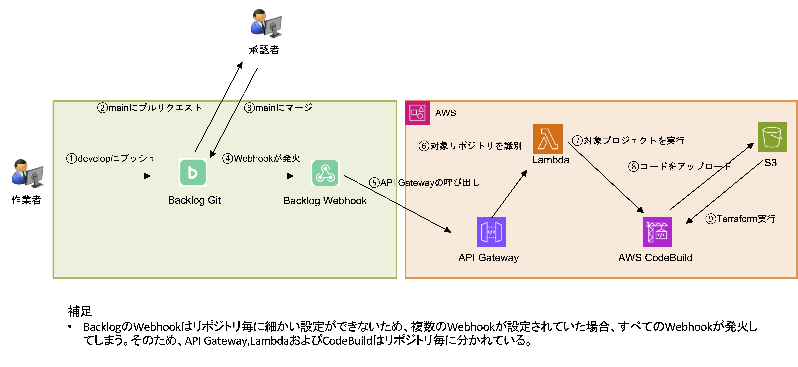

## 概要
- 本構成は、AWSの各リソースをTerraformでコード化したものです。CI/CDパイプラインにはBacklogのWebhookを活用しており、AWS上のパイプライン構成もTerraformで自動構築可能です。（※Secret Managerのみ手動登録が必要です）。
- 各サービスはモジュール単位で実装しており、再利用性・変更容易性・削除のしやすさを意識した構成としています。
- 一般的ではないBacklog Gitを利用したCI/CDパイプラインを採用することで、制限された環境下でもGitHub Actionsなどと同等のCI/CD基盤が構築可能である点を示しています。

## 前提条件
- BacklogでGitリポジトリを運用していること。
- BacklogでWebhookを送信できる（またはAPI Gateway中継可能）こと。
- AWSでは複数のサービスを作成するためある程度権限が必要になること。（できれば管理者権限）

## セキュリティ
- Backlogなどのクレデンシャルはハードコードせず、AWS Secrets Managerにて管理しております。
- IAMロールは管理者権限を付与せず、必要なサービスのみに絞っております。

## 構成

### 構成概要
- 本構成では、アプリケーション用のVPCを定期的に切り替えて利用する運用を想定しています。
- 定期的なVPCの切り替えを実施することで、DR（ディザスタリカバリ）対策として機能させています。
- 切り替えを通常運用に組み込むことで、有事の際の切り替えも素早く対応ができるようにしておき、結果として実効性の運用を実現します。
- 切り替え時の各サービスの作成はTerraformを使用します。
- 不要になった各サービスはTerraformで削除します。
- 切り替えはAWS Acceleratorのエンドポイントの作成を行い**重み**の変更を行います。リージョンが異なる場合はエンドポイントグループを追加して**トラフィックダイヤル**の値を調整します。切り替え作業もTerraformの**switchover**を使用して行います。

### 構成図


## Terraformのディレクトリ構成
### ルートディレクトリ
```bash
.
├── README.md
├── env/
├── modules/
├── src/
├── .gitignore
```

### envディレクトリ
```bash
env/
├── common/
├── common_os/
├── osaka-ap/
├── switchover/
├── tokyo/
├── tokyo-ap-A/
├── tokyo-ap-B/
```

### modulesディレクトリ
```bash
modules/
├── accelerator
├── accelerator_endpoint
├── acm
├── api_gw
├── api_gw_rest
├── auto_scaling
├── backup
├── cloudwatch
├── codebuild
├── direct_connect
├── direct_connect_attachment
├── efs
├── elb
├── iam
├── keypair
├── lambda
├── launch_template
├── rds
├── s3
├── security_group
├── security_group_ap
├── sns
├── transit_gw
├── transit_gw_attachement
├── transit_peering
├── vpc
├── vpc_acl
├── vpc_ap_acl
├── vpc_routetable
├── vpc_routetable_ap
├── vpg
```

## 作成されるAWSサービス一覧
| AWSサービス名           | 用途
|------------------------|------------------------------------------------------------------------------------------|
| VPC                    | VPC本体、サブネットACL、ルートテーブルなどのネットワーク基盤                             |
| Transit Gateway        | 各VPC間の接続、ピアリング構成                             |
| Direct Connect         | AWSアカウント間をダイレクトコネクトの接続するため                                             |
| VPN Gateway            | ダイレクトコネクトを接続するため                                                |
| EC2 Key Pair           | EC2インスタンス用のSSHキーペアの管理                                                      |
| IAM                    | IAMロール、ポリシーの定義・付与                                                           |
| Security Group         | セキュリティグループ、AP環境向けのバリエーションも含む                                   |
| Auto Scaling           | オートスケーリンググループと設定                                                          |
| Launch Template        | EC2インスタンス起動テンプレートの定義                                                    |
| Lambda                 | Webhook受信用のLambda関数の定義                                                           |
| S3                     | ソースコードやTerraform成果物のアップロード用S3バケット                                 |
| EFS                    | 各アプリケーションのログ保管用                                        |
| Backup                 | AWS Backupによるバックアッププランとバックアップ設定                                     |
| RDS                    | 各アプリケーション用                                        |
| Global Accelerator     | IPアドレス固定のため                                           |
| ELB                    | 負荷分散用                                   |
| CloudWatch             | 各AWSサービスのログ保管、メトリクスアラームの作成                                                   |
| SNS                    | 通知送信用のSNSトピック設定                                                               |
| API Gateway            | Webhook受信用のAPI Gateway（REST API含む）の構築                                         |
| CodeBuild              | Terraform実行用のCodeBuildプロジェクトおよびIAMロールの構築                              |
| ACM                    | SSL証明書（ACM）の発行およびリソースへの関連付け                                          |

## CI/CDパイプライン
### CI/CDパイプラインの流れ
1. 開発者が Backlog の Git リポジトリ（`develop` ブランチ）に Push  
2. `develop` ブランチから `main` ブランチへプルリクエストを作成  
3. 承認者が `main` ブランチへマージ  
4. Webhook が発火し、API Gateway を経由して Lambda 関数を起動  
5. Lambda 関数がイベント内容をフィルタし、条件一致時に CodeBuild を起動  
6. CodeBuild が Backlog Git から `git clone` を実行し、S3 にアップロード  
7. CodeBuild が S3 から最新コードをダウンロード  
8. CodeBuild が Terraform の `init → plan → apply` を順に実行  
9. Terraform により AWS リソースを構築または更新  
10. 実行ログが CloudWatch Logs に出力される  

### CI/CDパイプライン図


## 運用
### 運用オペレーション

### Terraformと実環境の差異
- Terraformで運用を行っていると、Terraformのコードと実際の環境に差異が生じることがあります。
これは、Terraformで環境を構築した後に、CLIやWebコンソールからリソースの作成・変更・削除を行ってしまうことが主な原因です。
### Terraformと実環境の差異解消
- Terraformのコードと実際の環境の差異を解消する方法の一つは、Terraform以外で作成した本番環境のリソースを必ずコードに反映させ、そのコードをステージング環境で適用・検証することです。そのうえで、本番とステージングの両環境に差異がないかを確認します。

  また、コードを適用する際には、各リソースの状態を事前に確認することも重要です。
  Terraformで変更を加える場合、「リソースが再作成されるのか？」「設定の変更のみで済むのか？」「ダウンタイムが発生する可能性はあるか？」といった観点でステージング環境への適用を行い内容を慎重に確認します。

  もしダウンタイムが発生するとしても、それが許容範囲であれば、今後はその変更をTerraformで一貫して管理するようにルールを徹底することが望ましいです。

